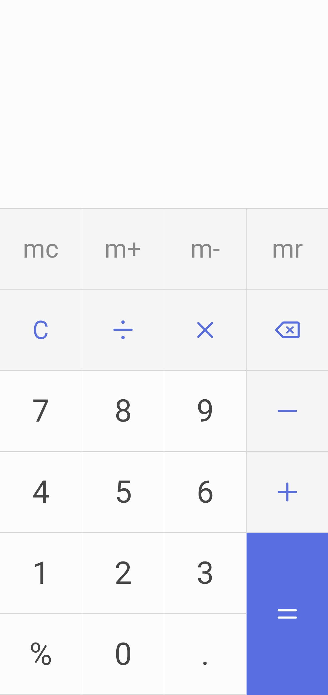

# JavaScript Calculator 

## Description

This calculator visually replicates the calculator of my current phone and some of it's functionality.

## Installation 

There's no installation required. 

## Usage 

Currently the calculator only allows clicked inputs, select the operands, operators and then press the equal sign to print the calculation. 

## License 

This is free and unencumbered software released into the public domain.

Anyone is free to copy, modify, publish, use, compile, sell, or
distribute this software, either in source code form or as a compiled
binary, for any purpose, commercial or non-commercial, and by any
means.

